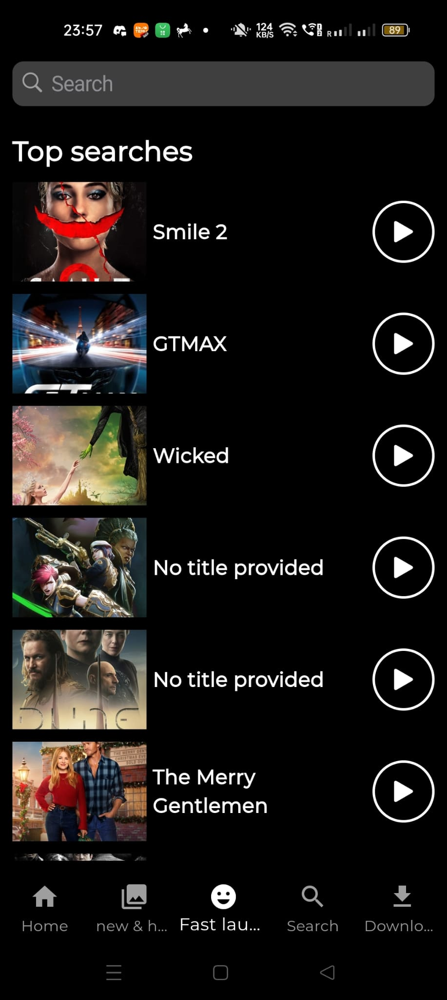

# Netflix_2

Netflix_2 is a Flutter-based mobile application that recreates the UI and functionality of Netflix. It demonstrates key features such as home screen navigation, video widgets, and data fetching using **Bloc** state management. The app is designed to provide a Netflix-like experience for learning and practice purposes.

---

## Features

- **Home Screen**: Displays categories such as "Released This Year," "Trending Now," and "South Indian Cinema."
- **New & Hot Section**: Includes tabs for "Coming Soon" and "Everyone's Watching" with video previews.
- **Search Functionality**: Search for movies and TV shows with debounced user input.
- **Bloc State Management**: Ensures smooth state transitions and data handling.
- **Reusable Widgets**: Video widgets, custom buttons, and modular UI components.

---

## Screenshots

### Home Screen


### New & Hot Section

*The "New & Hot" section featuring tabs for "Coming Soon" and "Everyone's Watching."*

*The "New & Hot" section featuring tabs for "Coming Soon" and "Everyone's Watching."*

### Search Functionality



---

## Getting Started

### Prerequisites

To view or run this project, you need:

1. **Flutter**: Install [Flutter](https://flutter.dev/docs/get-started/install) on your system.
2. **Android Studio**: Set up [Android Studio](https://developer.android.com/studio) for testing the app on an emulator or physical device.

### Installation

1. Clone the repository:

   ```bash
   git clone https://github.com/your-username/netflix_2.git
   cd netflix_2

2. Install dependencies:
    ```bash
    flutter pub get

3. Run the app:
    ```bash
    flutter run

---

## How to View the App

This app has not been uploaded to the Google Play Store or any other platform. To experience the app, follow these steps:

1. Install **Android Studio** by visiting [this link](https://developer.android.com/studio).
2. Clone this repository and open it in **Android Studio**.
3. Ensure that you have the Flutter SDK installed and properly configured.
4. Install all dependencies using the command:

   ```bash
   flutter pub get

5. Run the project on an emulator or a connected physical device:
    ```bash
    flutter run

---

## Dependencies

The project uses the following dependencies:

1. **Flutter**  
   - The mobile UI framework used to build the app.  
   - [Flutter Documentation](https://flutter.dev/docs)

2. **Flutter Bloc**  
   - For state management to handle user interactions and data flow efficiently.  
   - [Flutter Bloc Documentation](https://bloclibrary.dev/)

3. **Intl**  
   - For date formatting and localization.  
   - [Intl Package on pub.dev](https://pub.dev/packages/intl)

4. **Hive**  
   - Used for local storage and seamless API data management.  
   - [Hive Documentation](https://docs.hivedb.dev/)

5. **Cupertino Widgets**  
   - Provides iOS-style components to enhance the app's UI/UX.  
   - [Cupertino Widgets Documentation](https://flutter.dev/docs/development/ui/widgets/cupertino)

Make sure to install all dependencies by running:

```bash
flutter pub get

## 🧑‍💻 Author

**Sabarinadh**  
[GitHub Profile](https://github.com/Sabarinadh2002)